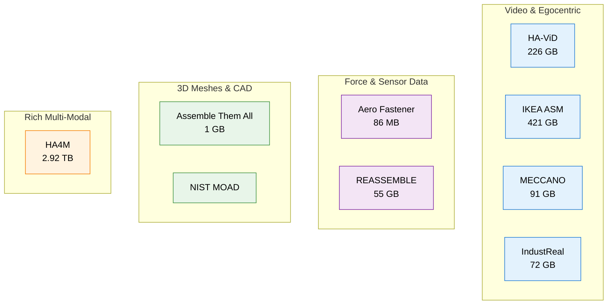

# KAMP Assembly Data Catalog

A public collection of manufacturing assembly datasets with easy-to-use Python loaders.

**Goal**: Make real manufacturing assembly data accessible so researchers and engineers can build better AI systems for assembly tasks.

## Overview

AI models are typically trained on internet data, not factory-style assembly data. This repository provides:
- A central catalog of publicly available assembly datasets
- Simple Python loaders that return clean metadata and download links
- Clear instructions for obtaining the actual data

## Available Datasets

| Dataset            | Size         | Key Modalities                                      | Focus Area                                      | Description |
|--------------------|--------------|-----------------------------------------------------|--------------------------------------------------|-------------|
| **Aero Fastener**  | 85.6 MB      | Force-torque, kinematics                            | Robotic screwing, success/failure detection      | Robotic screwing experiments with aeronautical threaded fasteners. |
| **Assemble Them All** | ~1 GB     | 3D CAD meshes, assembly sequences                   | Physics-based assembly planning                  | Thousands of physically valid industrial assemblies with diverse motions. |
| **HA-ViD**         | 226.63 GB    | Multi-view RGB video, skeleton                      | Human industrial assembly                        | 3,222 videos of humans assembling products with fine-grained action/object/tool labels. |
| **IKEA ASM**       | 420.97 GB    | RGB+depth, pose, object segmentation                | Furniture assembly                               | 371 multi-view furniture assembly videos with atomic action annotations. |
| **REASSEMBLE**     | 54.8 GB      | RGB, event camera, force-torque, audio              | Contact-rich robotic assembly                    | Multimodal dataset for robotic pick-insert-remove-place tasks. |
| **HA4M**           | 2.92 TB      | RGB, depth, IR, point clouds, skeleton              | Multi-modal mechanical assembly                  | 41 subjects building an epicyclic gear train with rich multi-modal data. |
| **IndustReal**     | 71.78 GB     | Egocentric RGB, error annotations                   | Procedural & execution errors                    | 27 participants assembling a toy car, with detailed error annotations. |
| **MECCANO**        | 90.619 GB    | Egocentric RGB+depth, gaze                          | Toy motorbike assembly                           | 20 participants building a toy motorbike with gaze-guided action anticipation. |
| **NIST MOAD**      | Not specified| RGB images, point clouds, CAD models                | Part geometry & mating                           | Objects and assemblies for NIST Assembly Task Boards 1–4. |

## Dataset Modalities Overview



## How to Use the Loaders

The loaders are designed to be **simple and reliable** — they take in the name of the dataset you plan to download as input and return metadata and download links for that dataset.

```python
from loaders import load_dataset, list_available_datasets

# 1. List all available datasets
list_available_datasets()

# 2. Load metadata for any dataset
data = load_dataset("Aero Fastener")

# 3. Access the information
print(data["dataset_name"])
print(data["description"])
print(data["download_link"])
print(data["note"])

# View detailed metadata
print(data["metadata"])
```

## How It Works


## Quick Start
```Bash
git clone https://github.com/yourusername/kamp-assembly-data.git
cd kamp-assembly-data

pip install -r requirements.txt

# Explore datasets
python -c "from loaders import list_available_datasets; list_available_datasets()"
```
## Repository Structure
```text
kamp-assembly-data/
├── README.md
├── catalog.csv
├── requirements.txt
├── loaders/
│   ├── __init__.py
│   ├── aero_fastener.py
│   ├── assemble_them_all.py
│   ├── nist_moad.py
│   ├── reassemble.py
│   ├── meccano.py
│   ├── industreal.py
│   ├── ha_vid.py
│   ├── ikea_asm.py
│   └── ha4m.py
├── data/                     # ← Place downloaded datasets here (optional)
└── test_loaders.py
```
